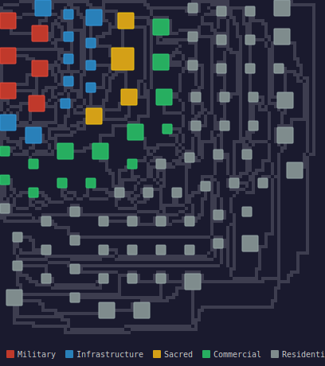

# oku
[[crates.io]](https://crates.io/crates/oku)
[[docs.rs]](https://docs.rs/oku)

PCB-inspired procedural city generation — a domain-specific facade over [ogun](https://github.com/EliasVahlberg/ogun).

Named after the Yoruba concept encompassing death and the afterlife — fitting for a generator that builds cities meant to be found as ruins.

<p align="center">
  
</p>

```toml
[dependencies]
oku = "0.2"
```

## Quick start

```rust
use oku::*;

let catalog = AgentCatalog {
    templates: vec![
        BuildingTemplate {
            name: "market".into(),
            category: Category::Commercial,
            radius: 2,
            priority: 0.8,
            connections: vec![],
            material: Material::Stone,
        },
        BuildingTemplate {
            name: "house".into(),
            category: Category::Residential,
            radius: 1,
            priority: 0.3,
            connections: vec![],
            material: Material::Wood,
        },
    ],
};

let spec = CitySpec {
    width: 40,
    height: 40,
    city_type: CityType::TradeHub,
    era: Era::Growth,
    beta: 2.0,
    seed: 42,
    erosion: None,
};

let city = generate(&spec, &catalog);
assert!(!city.buildings.is_empty());
```

## What it does

Oku translates urban concepts (building types, road demands, growth phases) into ogun's abstract spatial layout algorithm, then interprets the output back into city layouts. Optionally applies functional erosion to produce ruins.

## Architecture

```text
CitySpec + AgentCatalog
      │
  translate  →  ogun::Graph + Space + Config
                      │
                ogun::generate()
                      │
  interpret  ←  ogun::Layout
      │
  CityLayout
      │
  erosion (optional)
      │
  CityLayout (eroded)
```

- **ogun** — domain-agnostic. Nodes, edges, positions, potential functions, β.
- **oku** — domain-specific. Building types, road demands, growth phases, erosion, output formatting.

## Key concepts

- **β** controls city character: low β → organic medieval, high β → planned grid
- **Arrival order** controls growth pattern: founding → core → growth → infill
- **Erosion** degrades layouts into readable ruins via cascading failure
- **Hierarchical generation** calls ogun at multiple scales (district → block → building)

## Status

Early development. See `docs/OKU_STRUCTURE.md` for the full design exploration.

## License

MIT
